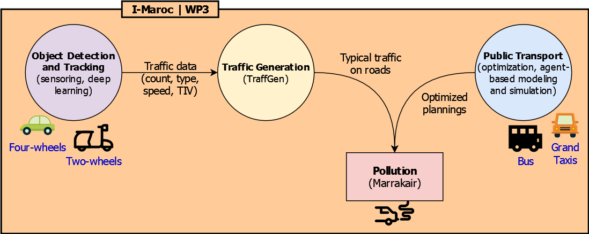
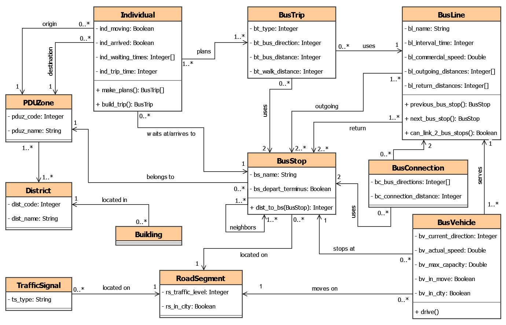
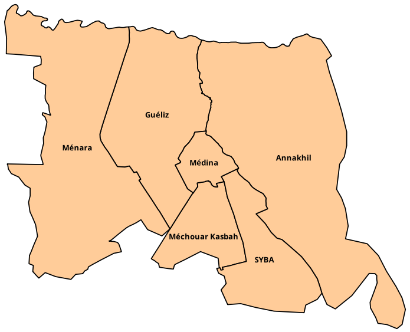
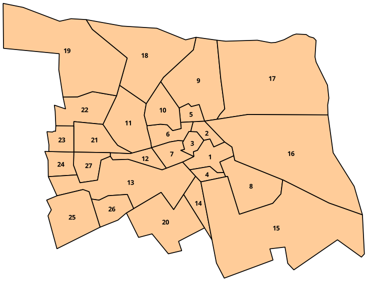
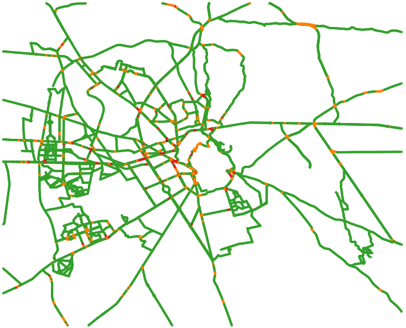
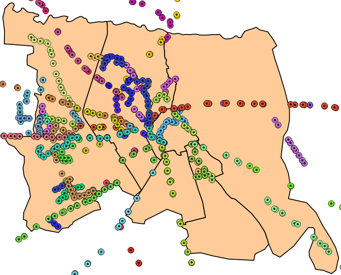

# I-Maroc Project

  

**I-Maroc** (_**I**ntelligence artificielle/**M**athématiques **A**ppliquées, santé/envi**RO**nnement: simulation pour l’aide à la dé**C**ision_) is a project that aims to design and implement computer simulations for health and the environment through advanced artificial intelligence, data analysis, and mathematical tools. In the **workpackage 3** (*urban and inter-urban mobility*), we focus on modeling various aspects of road traffic in Marrakesh to propose solutions and scenarios aimed at improving mobility and reducing pollution and congestion. Our primary approach involves using artificial intelligence to generate synthetical road traffic data, and using agent-based modeling and simulation to simulate/optimize the public transport network (Bus and Grand Taxis networks). These two axis are intended to minimize pollution associated with road traffic, which will be assessed using the [**MarrakAIR**](https://github.com/gnoubi/MarrakAir) model. 

  

We present here **MarraSIM**, our agent-based model that simulates the public transport network in Marrakesh. MarraSIM uses the [GAMA platform](https://github.com/gama-platform/).

# MarraSIM Model

**MarraSIM** (**Marra**kesh **SIM**ulator) is an agent-based model of road traffic and public transport in Marrakesh. We describe the structure and dynamics of the MarraSIM model following the protocol of the [ODD](http://eprints.bournemouth.ac.uk/33918/) (Overview, Design concepts, Details) standard and its extension, [ODD+2D](https://www.jasss.org/21/2/9.html) (ODD + Decision + Data).

## Overview

### Purpose
The model's purpose is to simulate public transport in Marrakesh in order to understand the complex interactions between transport demand, the bus network, and the Grand Taxis fleet. By utilizing realistic data that reflects traffic flow, origin-destination (OD) trips, and the public transport fleet, the model enables the testing of various strategies aimed at reducing waiting and travel times, enhancing public transport efficiency, and mitigating the environmental impact of road traffic in Marrakesh.

### Theoretical and empirical background
The model includes principal concepts and dynamics involved in the public transport and road traffic. We model a fleet of bus vehicles serving multiple bus lines to transport individuals between bus stops belonging to different zones in the city. A trip refers to using a bus to travel between two bus stops with no transfers. Individuals can reach their destination through journeys of one or two trips. When free transfert is not allowed, passengers prioritize journeys of single trips to minimize their travel cost.

### Entities, state variables, and scales

The model simulates a day (06:00 - 23:00) of public transport journeys in Marrakesh. The time step represents one minute. Bus vehicles move between bus stops to take and drop off people in outgoing and return journeys between a start point and a terminus. To simulate these dynamics, 11 agents are implemented to represent the city environment and the active agents. The following figure depicts the class diagram of the model.

  
 <i>UML Class diagram of the MarraSIM model.</i>

**Building** : this agent represent any type of buildings in the city (residential, industrial, commercial, ...). In the current version of the model, buildings are included only for visualization purpose.

**District** : represents one entity of the city's administrative division. Each district is identified by a code (*dits_code*) and a name (*dist_name*).

**PDUZone** : represents one entity of the adopted division in the PDU (Plan de Déplacements Urbains) document. Each PDU zone is identified by a code (*zone_code*) and a name (*zone_name*). This zoning is a sub-division of the administrative zoning, hence, a pdu zone may belong to one or multiple administrative districts.

**Individual** : represents one passenger that has a PDU zone (and a bus stop) as origin and another one as a destination. Each individual has to take a bus or a taxi to reach its destination while minimizing travel time and cost. An individual has four main attributes:
  - *ind_moving* : a boolean that indicates whether the individual has started its journey or not.
  - *ind_arrived* : a boolean that indicates whether the individual has reached its destination or not.
  - *ind_waiting_times* : a list of integers that indicates how much time (in seconds) the individual has been waiting at bus stops before taking transport means used in its journey.
  - *ind_trip_time* : an integer that indicates how much time (in seconds) the individual has traveled to reach its destination. This time starts when taking the first transport mean (at origin) and ends when leaving the last transport mean (at destination).

**BusStop** : represents a location where a bus can take or drop off individuals. A bus stop has a code (*bs_id*) and a name (*bs_name*) and may be an ordinary in-between stop, or a departure/terminus for one or multiple bus lines (*bs_depart_or_terminus*is set to true). Each bus stop has a list of neighbors (*bs_neighbors*) that can also be used to take a trip by any individual waiting at the bus stop. 

**RoadSegment** : represents one segment of the road network. All roads are divided into segments of 100m maximum. If a road segment is in the urban zone (represented by the boolean attribute *rs_in_city*), it can have a traffic density of four levels (attribute *rs_traffic_level*) corresponding to the levels of the Google Traffic API:

  -  Normal with no traffic delays (green).
  -  Medium traffic (orange).
  -  High traffic (red).
  -  Heavy traffic (dark red).

**TrafficSignal** : represents a sign that regulates traffic on the road network. A traffic signal may be stop sign where vehicles always stop for a given time, or a traffic light where vehicles stop following a given probability.

**BusLine** : represents two paths of outgoing and return bus stops between a start (departure) and an end (terminus) points. Each bus line is named (*bl_name*) and has the two following characteristics:
  - *bl_interval_time* : indicates the theoretical interval time between buses of the same line.
  - *bl_commercial_speed* : indicates the average speed of buses while considering the constraints of bus stops, traffic lights, and congestion.

**BusVehicle** : represents a vehicle that serves a bus line. The same bus line can be served by multiple vehicles. Each bus vehicle has the following attributes:
  - *bv_current_direction* : indicates whether a bus is currently in an outgoing or a return direction.
  - *bv_actual_speed* : indicates the true speed of a moving bus.
  - *bv_max_capacity* : indicates the maximum number of passengers that the bus can take.
  - *bv_in_move* : a boolean to indicate whether a bus is currently moving or not.
  - *bv_in_city* : a boolean to indicate whether a bus is currently in the city or in the suburbs.

**BusConnection** : determines a location where passengers can transfer between two bus lines. This connection may be in the same bus stop if the two bus lines intersect, or in two neighboring bus stops otherwise. The proximity in this model is defined as a 400m circle. The connections are computed to minimize the total journey distance, hence, only the best connections are considered. Each bus connection in the model is characterized buy the directions of connected bus lines (*bc_bus_directions*) and by the distance between connected bus stops (*bc_connection_distance*).

**BusTrip** : represents a trip between an origin and a destination bus stops using one bus line. The following attributes characterize a bus trip:
  - *bt_type* : indicates whether the trip is used as a single trip or within a journey with multipe trips.
  - *bt_bus_direction* : stores the direction (outgoing or return) of the used bus line.
  - *bt_bus_distance* : stores the traveled distance by the bus used in the trip.
  - *bt_walk_distance* : indicates the walk distance between bus stops used during the trip. This includes the walking distances to: 1) reach the start bus stop; 2) connect between transfer bus stops if the journey includes a connection; 3) and to reach the final destination from the end bus stop.  

### Process overview and scheduling
At each time step (each minute), bus vehicles move between bus stops to take or drop off passengers. Bus vehicles may be delayed by stopping at traffic signals (*TS_STOP_WAIT_TIME*), by taking/dropping of passengers at bus stops (*(BV_TIME_TAKE_IND + BV_TIME_DROP_IND) x number of passengers*), or by the traffic congestion at congested roads (orange/red/darkred). The delay of traffic congestion is computed at each time step as follows : *( (bv_commercial_speed - bv_acutal_speed) / bv_commercial_speed ) x timestep*.

Each 10 minutes, a percentage (depending on the current affluence) of new passengers is distributed over bus stops to wait for a bus. Each passenger waits at the bus stop and takes the first bus that can transport him to his destination. If the transfer is off, passengers prioritize busses that can do a 1-line trip to the destination, and wait at least 1 hour before taking a 2-lines bus. If transfer is on, all passengers take the first relevant bus.

Each hour, the state of roads is updated to consider the current traffic level that impact the circulation speed of busses. Affluence of passengers is also updated.

## Design concepts  
  1- *Individual decision-making* : 

  2- *Learning* : in the current version of the model, agents do not perform any learning mechanism.

  3- *Individual sensing* :

  4- *Individual prediction* : in the current version of the model, agents do not make any predictions.

  5- *Interaction* :

  6- *Collectives* :

  7- *Heterogeneity* :

  8- *Stochasticity* :

  9- *Observation* : 

## Details

### Implementation details 

### Initialization

At initialization, the simulation environment is created based on the shapefiles (in "*/includes/gis/*") representing districts, buildings, PDU zones, road network, traffic signals, and bus stops. Then bus lines, bus connections, bus vehicles, individuals, and travel plans are created based on data files in "*/includes/csv/*".

### Input data

#### Data overview

Data include shapefiles and data on the bus network, traffic, and mobility. These data come from different sources including online databases (OSM: OpenStreetMap) and websites (ALSA: public transport company in Marrakesh) and official reports (PDU: Plan de Déplacements Urbains 2009).

  - **Shapefiles** : serve to build the simulation environment (infrastructure and visual aspects). The included shapefiles are:

     - *Administrative boundaries of districts* : the official zoning of the city. In Marrakesh, there are six districts: Médina, Guéliz, Annakhil, Méchouar-Kasbah, Sidi Youssef Ben Ali (SYBA), and Ménara. The shapefile is downloaded from OSM.
    

    
     <i>Administrative districts of Marrakesh.</i>
    

    
    - *PDU zoning* : The PDU (Plan de Déplacements Urbains) is a big study that was conducted in 2009 to describe and evaluate the urban mobility and population movement in Marrakesh. The study divided the city into 27 zones based on multiple criteria of geography and urban fabric. We use this zoning since all the data presented in the PDU document is based on it.
      

      
       <i>The 27 PDU zones of Marrakesh.</i>
      

    - *Road network* : the shapefile is downloaded from OSM and filtered to inlude only relevant roads used by bus lines and Grand Taxis.
    

    
     <i>Urban road network of Marrakesh with traffic levels.</i>
    

    - *City buildings* : this shapefile represents available buildings on OSM. These data are not mandatory for the model since buildings are only used for visualization purposes. Buildings objects (polygons) are merged (dissolved) into one spatial object to lighten simulations.

    - *Bus stops network* : bus stops data was extracted from the public transport company website as a JSON file that was converted to a shapefile. These data were incomplete and erroneous and were manually treated to complete missing bus stops and correct erroneous data.
    

    
     <i>Bus stops in the urban Marrakesh.</i>
    

    - *Traffic signals network* : the shapefile of traffic signals was downloaded from OSM and filtered to include only traffic lights and stop signs. 
  
  - **Traffic data** : we use data from Google Traffic to simulate realistic traffic (congestion) levels. For a specified day, we download the typical traffic image for each hour (between 06:00 and 23:00), and convert those satellite images to shapefiles representing the road network with traffic levels. To facilitate conversion, we divide roads to 100m road segments each. The conversion is done through a color correspondance using the four levels (colors) of Google Traffic. 
  
  - **Mobility data** :
      
#### Data structure
#### Data mapping
#### Data patterns

### Submodels

# Preliminary results

## Simulated scenarios

### Impact of road congestion
Controlling congestion levels can unveil the impact of congestion on bus efficiency. For example, we can limit congestion to two levels only (green and orange) to evaluate how high and heavy traffic influence observed delays.

### Impact of free tranfer strategy
Implementing a the trasnfert strategy allow passengers to take the second bus for free, therefore, an individual does not prioritize 1-line trips anymore, and can take the first bus that can transport him to destination.

### Impact of timetables strategy
When an individual has information about bus timetables, he can wait for the best bus option instead of taking the first one that arrives.

### Impact of BRT lines
We simulate the implantation of BRT (Bus Rapid Transit) lines to assess their impact on the general performance of the bus network.

### Impact of individual taking/dropping off
By variating the constante *BV_TIME_TAKE_IND*, we can simulate the impact of implementing strategies to facilitate taking passengers. This delay is important as the bus driver is also responsible for selling bus tickets. 

  
   <i>The graphical interface of MarraSIM model under the GAMA platform.</i>

